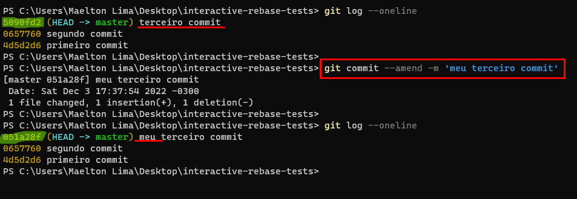

# Git Commit Amend

### git commit --amend -m "an updated commit message"

 

The git commit --amend command is a convenient way to modify the most recent commit. It lets you combine staged changes with the previous commit instead of creating an entirely new commit.  

It can also be used to simply edit the previous commit message without changing its snapshot. But, amending does not just alter the most recent commit, it replaces it entirely, meaning the amended commit will be a new entity with its own ref. To Git, it will look like a brand new commit.   

